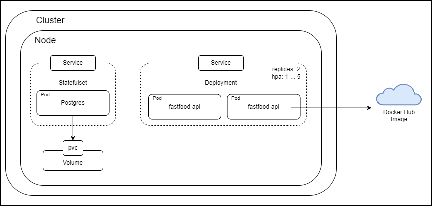
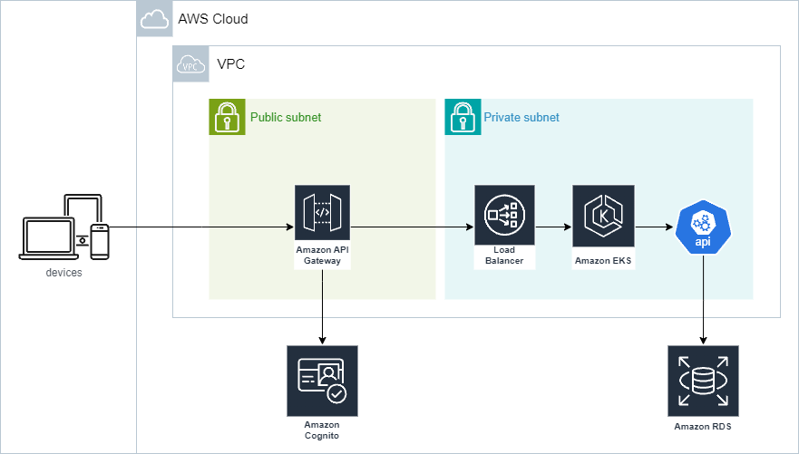
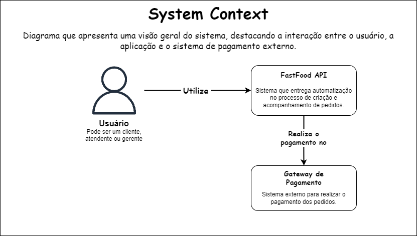

# Fast food APIs - Tech Challenge - 8SOAT FIAP

Nome da equipe: Grupo 60

[Apresentação do projeto no youtube](https://www.youtube.com/watch?v=6UqZ5yKJFNg&ab_channel=ZodhinJava)

### Contato dos participantes do projeto: 

- Discord: Felipe Carvalho - RM357341 / @ifelipedev

- Discord: Guilherme Meireles - RM357216 / @guilherme100

- Discord: Robson Arcoleze - RM356969 / @robsonarcoleze

### Descrição

Este projeto é o trabalho feito pelo time 15 para solucionar o desafio técnico do tech challenge. O projeto se consiste em um conjunto de APIs desenvolvidas usando as técnicas ensinadas durante o curso, essas APIs servem para atender as necessidades de uma lanchonete de bairro.

### Desenho da arquitetura

#### K8S


#### AWS


#### Negócio


### Rodando projeto pelo K8S
Lembre-se de ter o kubectl instalado em sua máquina, e caso queira criar clusters Kubernetes locais usando o Docker,
você pode utilizar o kind.

Na pasta k8s/develop, execute os comandos em sequência:

```
kubectl apply -f fastfood-secret.yaml

kubectl apply -f fastfood-db-statefulset.yaml

kubectl apply -f fastfood-db-service.yaml

kubectl apply -f fastfood-api-deployment.yaml

kubectl apply -f fastfood-api-service.yaml

kubectl apply -f payment-api-deployment.yaml

kubectl apply -f payment-api-service.yaml

```

Para conseguir realizar as requisições em sua máquina, digite o comando: kubectl port-forward <NOME_DO_POD> 8080:8080.

## Rodando o projeto com docker-compose

Na pasta do projeto, execute o comando: `docker-compose up`.

## Trello (atividades de desenvolvimento do projeto):
[Trello - Tech Challenge 8SOAT FIAP / Team 15](https://trello.com/b/RRTCdSx4/8soat-time-15)

## Miro (desenho da solução do projeto)
[Modelagem - MIRO](https://miro.com/app/board/uXjVK5Fs-r0=/)

## Verificando APIs do projeto (Swagger) & Postman

Um arquivo com todas as requisições (Postman) foi adicionado na raiz do projeto. Contudo, para seguir conforme o solicitado, disponibilizamos as APIs do projeto no swagger abaixo:

Acessar http://localhost:8080/swagger-ui/index.html#/ quando a aplicação estiver rodando.

Postman: [Collection POSTMAN](fastfood-api%20-%20validation.postman_collection.json)


### Aws Academy

Para setar suas credenciais da aws, acesse o aws academy, clique em 'AWS Details' para pegar suas credenciais, depois
jogue no arquivo: `C:/Users/gmeir/.aws/credentials`. (Elas duram 4 horas, depois é necessário repetir o passo a passo)

Para cada fase, devemos mudar o valor de `var.labRole`, para isso vá em IAM > Funções > LabRole (copie o ARN).

Com isso, podemos executar os comandos `terraform init` e em seguida `terraform apply` na ordem abaixo:

1° Em ./terraform

2° Em ./terraform/modules/rds (Após subir o RDS, execute os scripts de `init.sql`, caso faça a conexão pelo Intellij
clique com o botão direito em postgres > SQL Scripts > Run SQL Scripts...)

3° Em ./terraform/modules/eks

Agora, rode os comandos: `aws eks --region us-east-1 update-kubeconfig --name fastfood-api` e em seguida:
`kubectl get svc` e pegue o valor de **EXTERNAL-IP**

4° Em ./terraform/modules/lambda, adicione esse **EXTERNAL-IP** em `variables.tf` em externalIp e rode os comandos terraform.